schema -> structure of the data
model -> individual schema object
query-> query that we make

steaps :- 
1. connect to database
2. create schema in a different js file
3. create a model & export it

- create a new file for the schema

ERRORS:-

1. Type error

    Since we are assigning a  ```String``` value to ```age```  but it's of ```Number``` type.
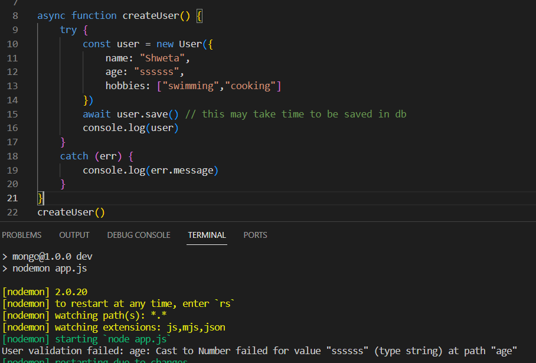

<br>

2. Required 
    Since the ```email``` field is not given.
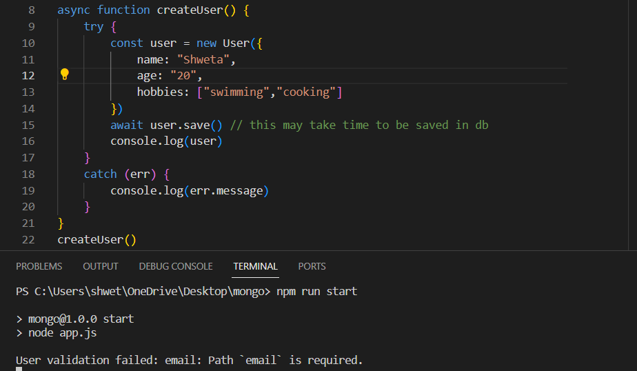


<br>

3. Range

    since we have set age to be in between 5-100, so the entered age can't be 2.

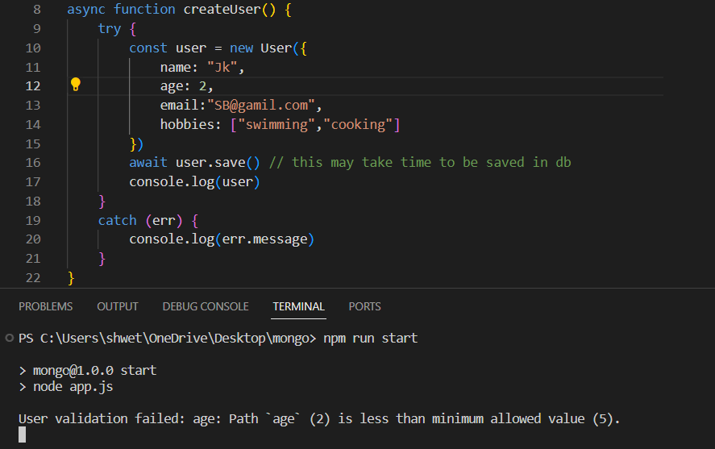


<br>

- the name should contain atleast 5 characters.

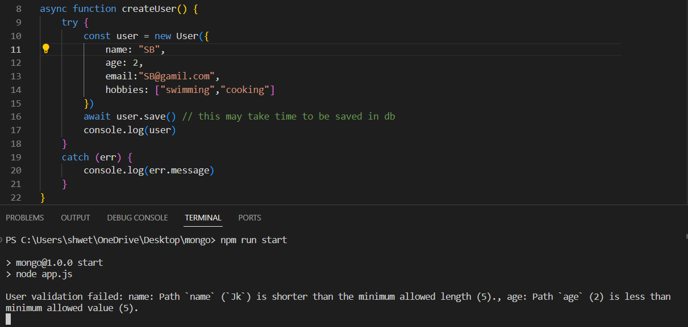

<br>


4. Creating Our own Validator
    Since name can't contain digits.

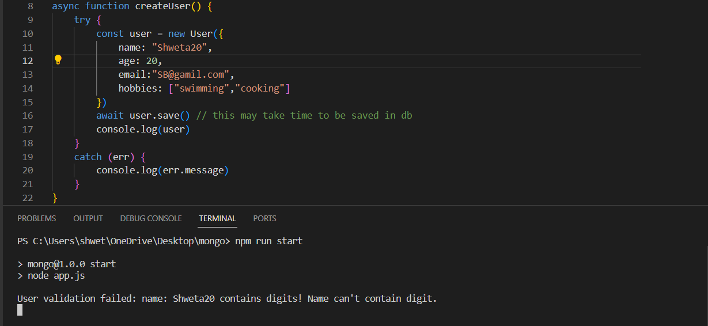


<h4>NOTE: These all validations will work only when we are using save/create methods, i.e. on using the update methods(like updateOne(), updateMany() ) then the values provided won't go through the validation.</h4>


<h3>lowercase: true</h3>
    it converts the email to lowercase before storing in db.

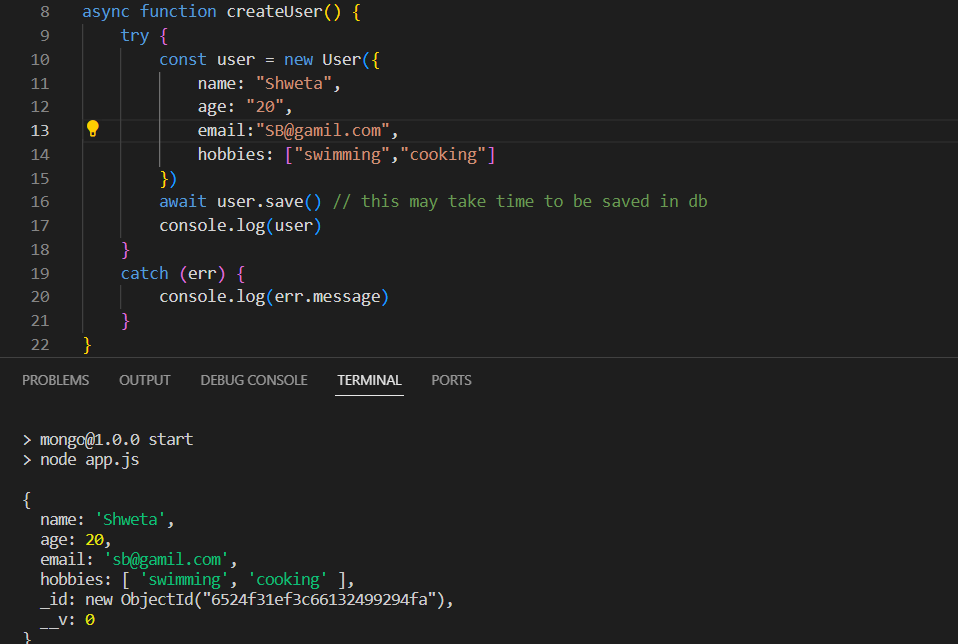


## OUTPUT

<h3> createUser()</h3>

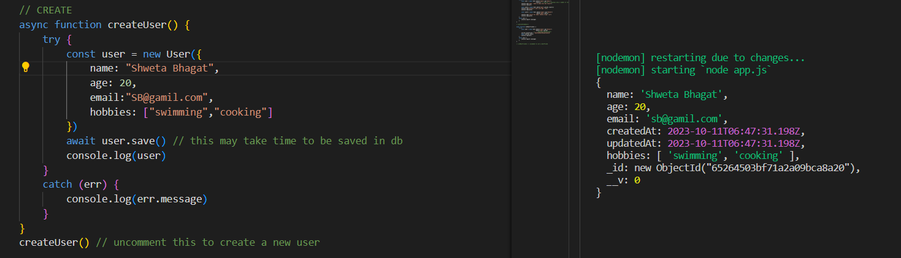

<br>

<h3> findUser(userID)</h3>

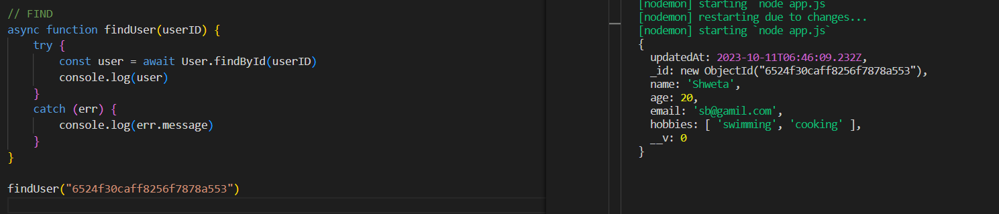

<br>

<h3> deleteUser(userID)</h3>

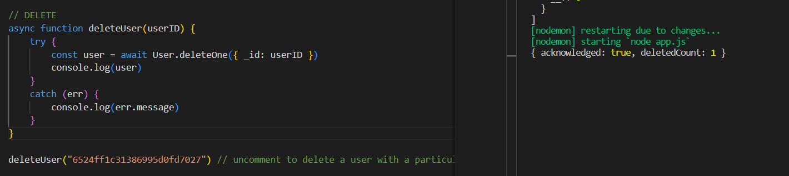

<br>

<h3> queryToFindUser()</h3>

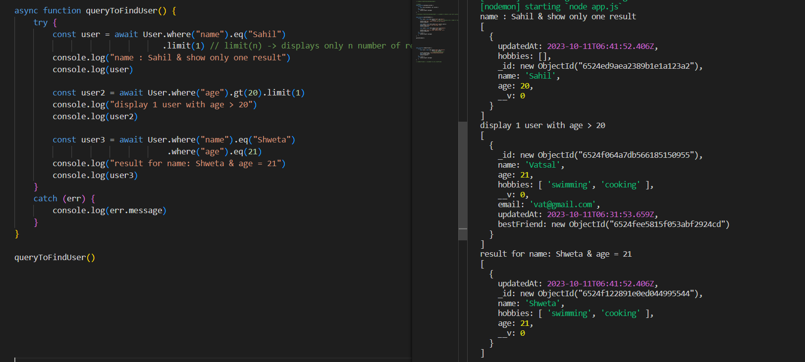

<br>

<h3>setBestfriend()</h3>

- adding bestFriend

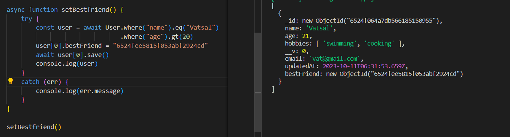

<br>

- populating bestFriend

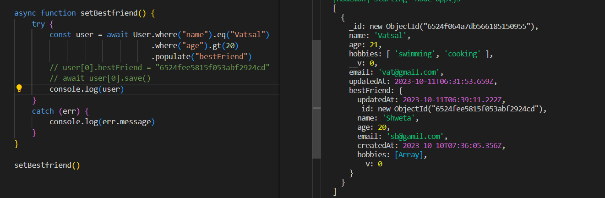


<h2>Schema Methods</h2>

<h3>Custom Instance Method </h3>

    model instance -> document

- We can create custom helper methods on the schema and access them via the model instance(```instanceName.methodeName()```).
- These methods will have access to the model object
- Arrow function can't be used because we can't use ```this``` in arrow function


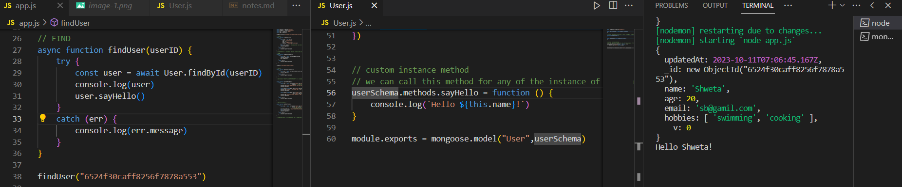

<br>

<h3> Static </h3>

- It gets applied on model, therefore we use it as ```modelName.staticMethodName()```

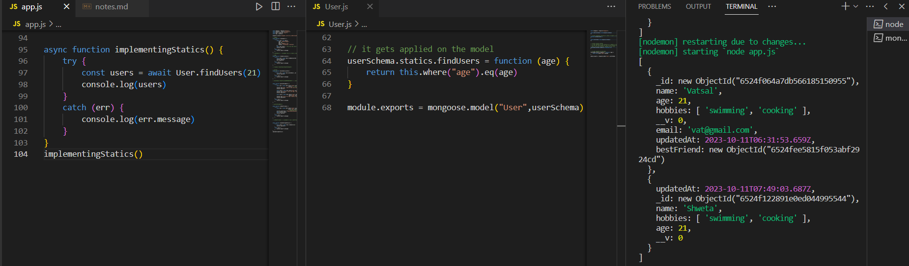


<h2>Middleware</h2>

- Middleware are the functions that run at specific stages of pipeline.
- Mongoose supports middleware for the following:- 

        1. Aggregate
        2. Document
        3. Model
        4. Query

Model has ```pre``` and ```post``` functions that take two parameters:-

    1. Event ('save','remove','init','validate')
    2. Callback

Example:- 

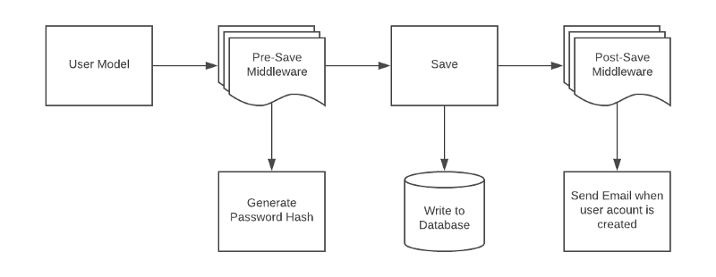


- Updating the date before saving the instance

- calling sayHello() method after saving.

- NOTE: we can't use this.sayHello(), instead we have to use the document(i.e. the instance that got created)

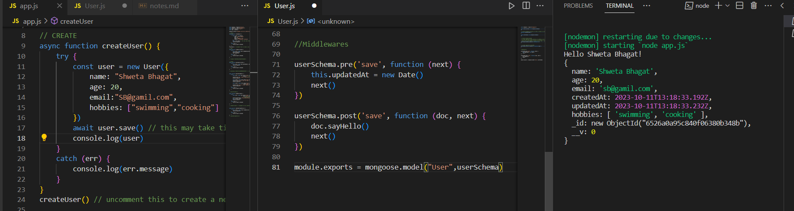


- It should be noted that we will be getting an error if we don't write next(), as the control won't be sent to the next middleware or function to perform its operation.

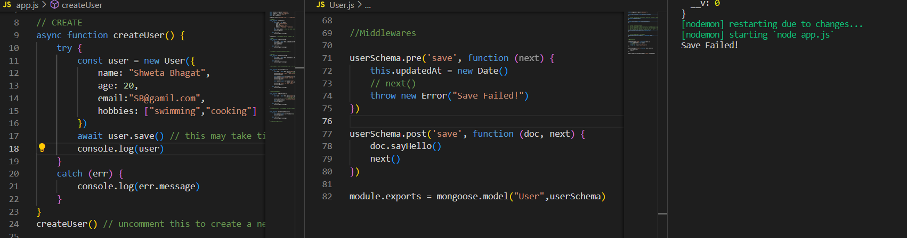